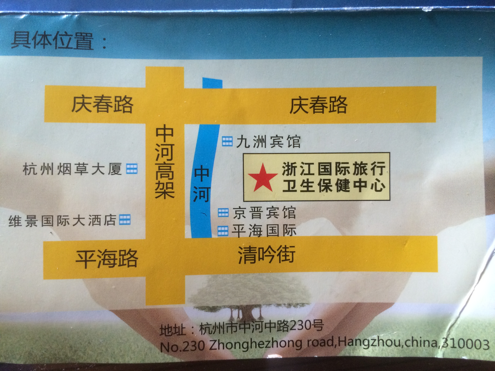
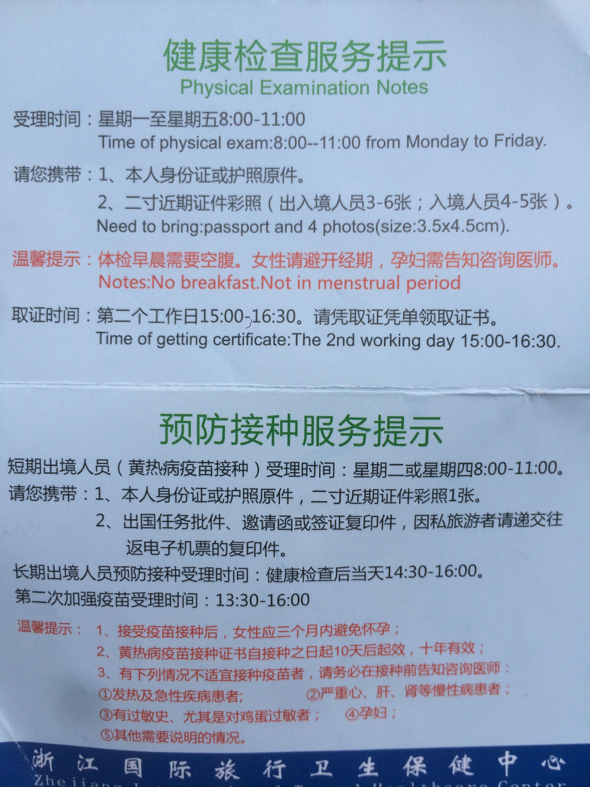

出国体检一般是国家要求的：
“出境居住1年以上人员如出国留学人员等，均需提前到出入境检验检疫机构进行健康体检及预防接种，办理了“国际旅行健康证书”和“国际旅行预防接种证书”后，方可办理相关出国手续。” [杭州卫生委](http://www.hzws.gov.cn/site/show.asp?id=14130)

接种疫苗或者是PDD皮试一般是学校要求的，每个学校的要求不同。

###浙江国际旅游卫生保健中心

咨询电话：0571-87852410

地点：杭州市中河中路230号（京晋大厦旁）



体检时间：08：00-11：30

接种疫苗时间：14：30-16：00
（下午实际上班时间是从13:30开始，13:30-14:30接受接种疫苗申请办理）（PDD皮试也是在下午的接种疫苗时间进行）

一般都是上午去，办理好体检和接种疫苗的手续，然后进行体检。吃过午饭之后，下午再来接种疫苗以及进行PDD皮试。

###需要的文件：

1. 身份证原件
2. 二寸白底照片4张
3. 申请学校的体检表格
4. 现金若干（建议700¥）

###体检流程：

早晨起来之后，空腹前往！

进入大厦后，先在一楼大厅取号交钱拿表格。

4号窗口为咨询窗口。

6号窗口为取号窗口。

1-3号窗口是办理体检并交费的窗口。

光体检的费用为362¥。

疫苗费用根据需要打的疫苗种类数量不同，价格也不同。

交完钱之后，将体检表格背面的检测项目挨个做完即可。

1. 采血（需空腹）及尿检
2. B超（需空腹，无需憋尿）
3. 心电图
4. 一般检查（血压，身高体重）
5. 五官科（色盲，视力）
6. 内科
7. X光胸透


###接种疫苗／PDD皮试流程：

若上午已经办理好接种疫苗的手续，下午14:30-16:00前往卫生保健中心。若还未办理接种疫苗的手续，推荐13:30-14:30之间就前往卫生保健中心，先办理接种疫苗的手续，然后14:30之后即可开始接种疫苗。

接种疫苗的地点在大厦的二楼。

接种完疫苗之后，需要等待半小时，看没有什么反应之后才能离开。

一般来说，第二个工作日的15:00-16:00即可回来拿 小红本（体检纪录）和体检报告。但是建议先打电话确认，再前往。

PDD皮试需要在48-72小时内返回医院（需严格在这个时间范围内），查看PDD皮试情况。然后即可向医生索取 小黄本（疫苗接种纪录）。有些需要打第二针的疫苗，再在指定日期回来打即可。


###其他信息
